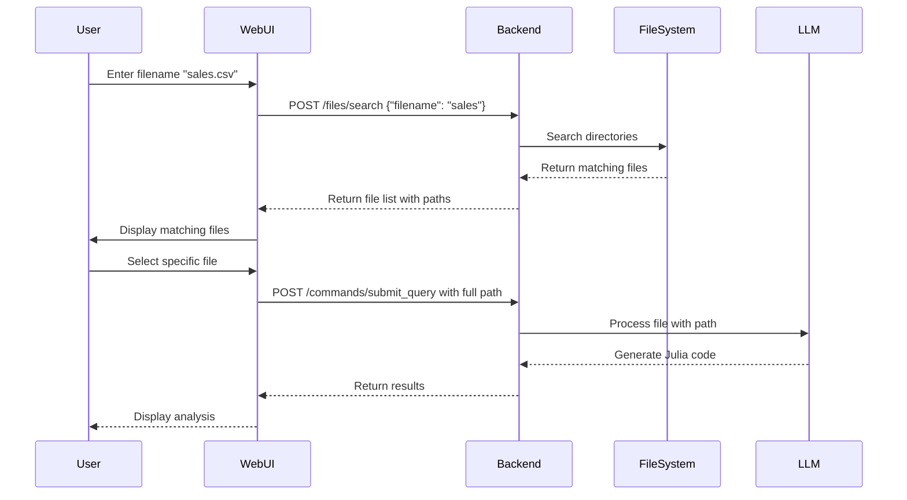

# File Search Solution for Web UI

## Problem
The web UI (when accessed through a browser) cannot access full file paths directly due to browser security restrictions. When a user wants to process a local file, the browser can only see the filename, not the full path.

## Solution
We've implemented a file search REST endpoint that allows the web UI to:
1. Search for files by name on the server's filesystem
2. Present matching files to the user for selection
3. Use the selected file's full path for processing

## Implementation

### Backend Components

#### 1. File Search Module (`crates/notebook_server/src/file_search.rs`)
- Searches common directories (home, downloads, desktop, documents, /tmp)
- Supports custom search paths
- Returns file metadata (path, size, modified date)
- Case-insensitive matching
- Configurable max results and search depth

#### 2. REST Endpoint (`/files/search`)
- POST endpoint accepting JSON payload
- Request format:
```json
{
  "filename": "search_term",
  "search_paths": ["optional", "custom", "paths"],
  "max_results": 20
}
```
- Response format:
```json
{
  "success": true,
  "matches": [
    {
      "path": "/full/path/to/file.csv",
      "directory": "/full/path/to",
      "filename": "file.csv",
      "size": 1234,
      "modified": "2024-01-15 10:30:00"
    }
  ]
}
```

### Frontend Integration

#### Demo Page (`apps/web-ui/file-search-demo.html`)
Shows how to integrate the file search:
1. User enters a filename or partial name
2. Frontend calls `/files/search` endpoint
3. Results are displayed with full paths
4. User selects a file
5. Selected file's full path is sent to `/commands/submit_query` for processing

### Workflow



## Usage Example

### 1. Search for CSV files:
```bash
curl -X POST http://localhost:8080/files/search \
  -H "Content-Type: application/json" \
  -d '{"filename": ".csv", "max_results": 10}'
```

### 2. Search in specific directories:
```bash
curl -X POST http://localhost:8080/files/search \
  -H "Content-Type: application/json" \
  -d '{
    "filename": "data",
    "search_paths": ["/Users/username/projects", "/tmp"],
    "max_results": 5
  }'
```

## Benefits

1. **Security**: No direct filesystem access from browser
2. **User-Friendly**: Users can search by partial name
3. **Flexible**: Supports various file locations
4. **Metadata**: Shows file size and modification date
5. **Integration**: Works seamlessly with existing file processing pipeline

## Future Enhancements

1. **File type filtering**: Add option to filter by extension
2. **Recent files**: Track and prioritize recently used files
3. **Indexed search**: Use a file index for faster searches
4. **Preview**: Add file content preview in search results
5. **Permissions**: Check file read permissions before listing

## Testing

To test the file search functionality:

1. Start the server:
```bash
cd /path/to/cedarcli
OPENAI_API_KEY=your_key cargo run -p notebook_server
```

2. Open the demo page:
```bash
open apps/web-ui/file-search-demo.html
```

3. Search for a file and process it through the UI

## Integration with Main UI

To integrate this into the main Cedar UI, add similar JavaScript code to handle:
1. File search when user clicks "Browse" or similar
2. Display search results in a modal or dropdown
3. Pass selected file path to the processing pipeline

This solution bridges the gap between web browser limitations and local file access needs, providing a secure and user-friendly way to process local files through the web UI.
